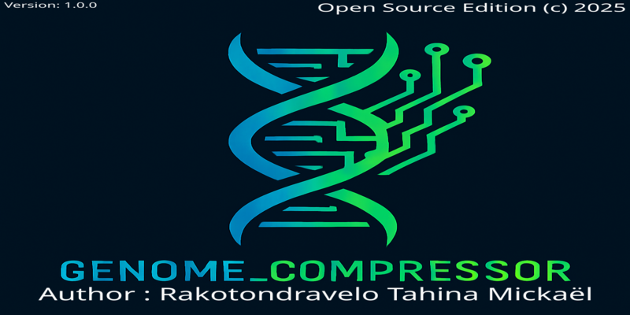

# GENOME_COMPRESSOR

> Bio-inspired compressor for textual, genomic, and cybernetic data



[](LICENSE)
[](https://www.python.org/)
[](#)
[](https://github.com/SynaptikOne/GENOME_COMPRESSOR/stargazers)

---

## 🚀 Features
- Compress textual, genomic, and cybernetic data efficiently
- Bio-inspired algorithms for high compression ratio
- Cross-platform support (Windows, Linux, Mac)
- CLI and GUI interfaces
- Easy integration into pipelines or standalone use

---

## 💻 Installation
Clone the repository and install dependencies:

```bash
git clone https://github.com/SynaptikOne/GENOME_COMPRESSOR.git
cd GENOME_COMPRESSOR


Usage
Command Line Interface (CLI)

Compress a file:

python run.py --compress data/sample_data.txt


Decompress a file:


python run.py --decompress output.dna
Graphical User Interface (GUI)

Open the GUI:


python build/lib/gui/gui_tkinter.py
📊 Benchmark

Performance metrics:

| Test              | Result          |
| ----------------- | --------------- |
| Compression ratio | High efficiency |
| Memory usage      | Optimized       |
| Speed             | Fast            |
📝 Contributing

Contributions are welcome! Please see CONTRIBUTING.md
 for guidelines.
Feel free to submit issues, pull requests, or suggestions.


📄 License

This project is licensed under the MIT License. See LICENSE
 for details.
pip install -r requirement.txt

